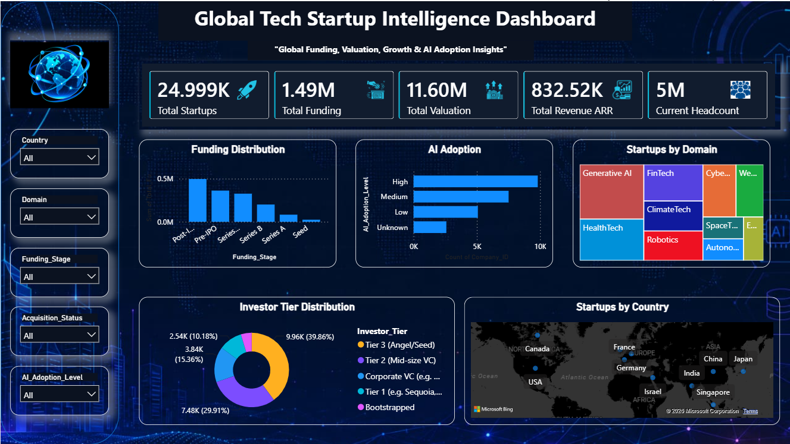
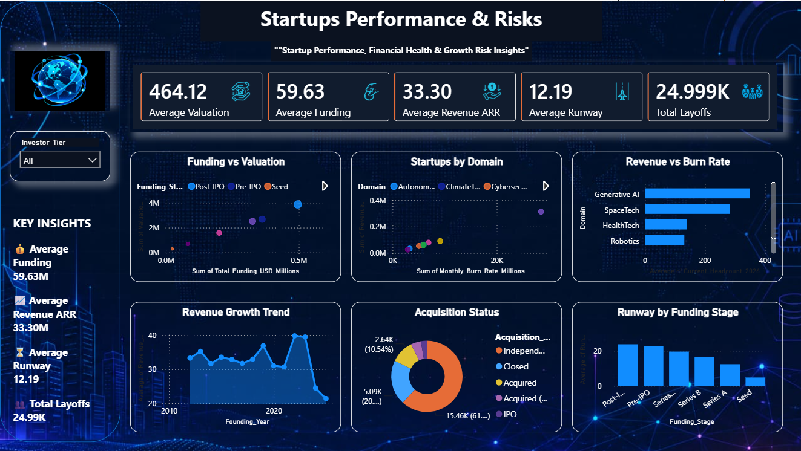

# 🌍 Global Tech Startup Intelligence Dashboard

An interactive **Power BI Business Intelligence dashboard** designed to analyze the global technology startup ecosystem across funding, valuation, revenue, AI adoption, investor tiers, operational performance, and growth-related risk indicators.

---

## 📊 Project Overview

The **Global Tech Startup Intelligence Dashboard** transforms startup data into an interactive analytical solution using Power BI.

The dashboard provides a consolidated view of startup performance and enables exploration across countries, technology domains, funding stages, investor tiers, AI adoption levels, acquisition status, financial performance, and growth indicators.

---

## 🎯 Business Objectives

- Analyze startup funding and valuation patterns.
- Explore startup distribution across countries and technology domains.
- Understand AI adoption levels across startups.
- Analyze investor tier distribution.
- Compare startup funding with valuation.
- Examine revenue and monthly burn-rate patterns.
- Analyze acquisition status across startups.
- Evaluate runway across funding stages.
- Explore revenue growth trends across founding years.

---

## 📌 Key Metrics

| Metric | Value |
|---|---:|
| Total Startups | 24.999K |
| Total Funding | 1.49M |
| Total Valuation | 11.60M |
| Total Revenue ARR | 832.52K |
| Current Headcount | 5M |
| Average Valuation | 464.12 |
| Average Funding | 59.63 |
| Average Revenue ARR | 33.30 |
| Average Runway | 12.19 |
| Total Layoffs | 24.99K |

---

# 📈 Dashboard Pages

## 1. Executive Overview

Provides a high-level view of the global startup ecosystem.

### Key Analysis

- Startups by Country
- Funding Distribution by Funding Stage
- Startups by Domain
- Investor Tier Distribution
- AI Adoption Analysis
- Interactive filtering by:
  - Country
  - Domain
  - Funding Stage
  - AI Adoption Level
  - Acquisition Status

### Dashboard Preview



---

## 2. Performance & Risk Analysis

Focuses on startup financial performance, operational indicators, growth, and risk-related analysis.

### Key Analysis

- Funding vs Valuation
- Startup Performance by Domain
- Revenue vs Burn Rate
- Revenue Growth Trend
- Acquisition Status
- Runway by Funding Stage
- Investor Tier Analysis

### Dashboard Preview



---

# 🛠️ Tools & Technologies

- **Power BI** — Dashboard development and visualization
- **Power Query** — Data transformation and preparation
- **DAX** — Analytical calculations and measures
- **CSV** — Source and cleaned datasets

---

# 🔄 Data & Analytics Workflow

```text
Raw Startup Dataset
        ↓
Data Cleaning & Preparation
        ↓
Power BI Data Transformation
        ↓
Data Modeling
        ↓
DAX Measures
        ↓
Interactive Dashboard
        ↓
Business Analysis & Insights

---

# 👤 Author

**Abhishek Jha**

B.Tech Computer Science & Engineering

**Skills:** Power BI • SQL • Python • Excel • Data Analytics
